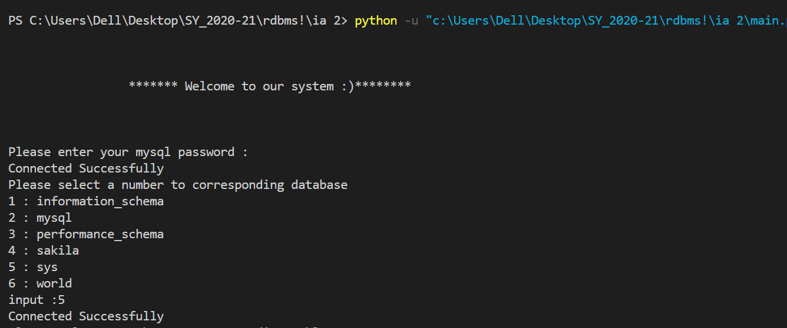
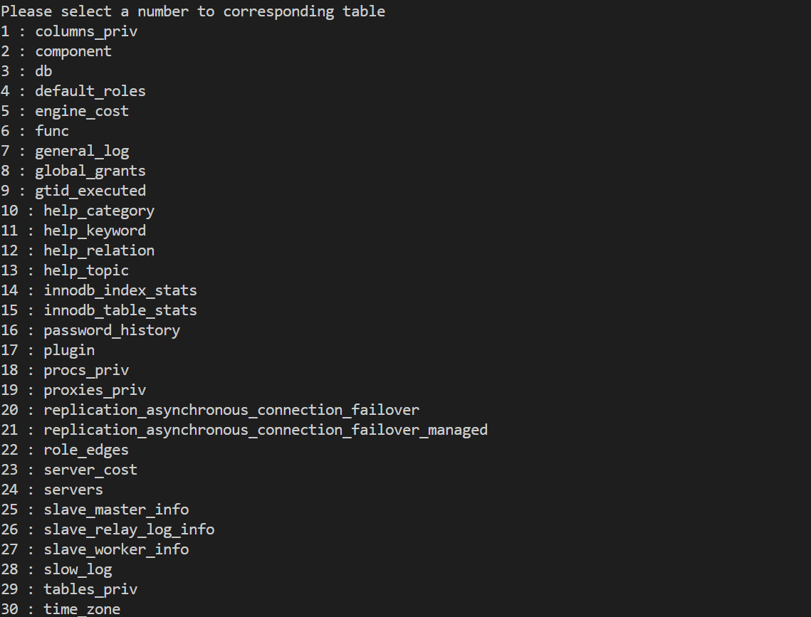
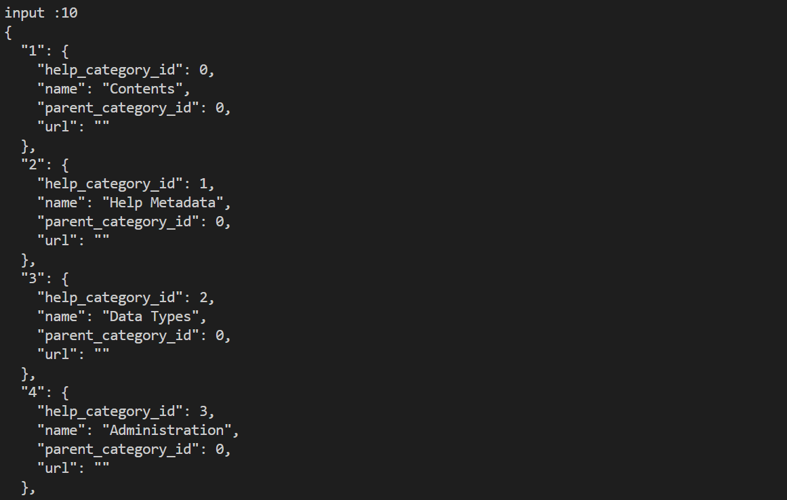
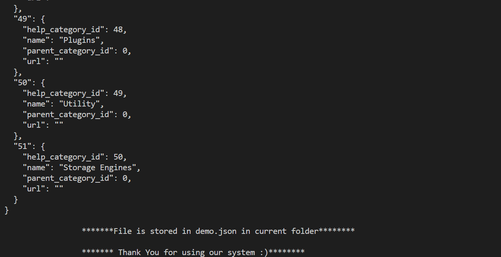
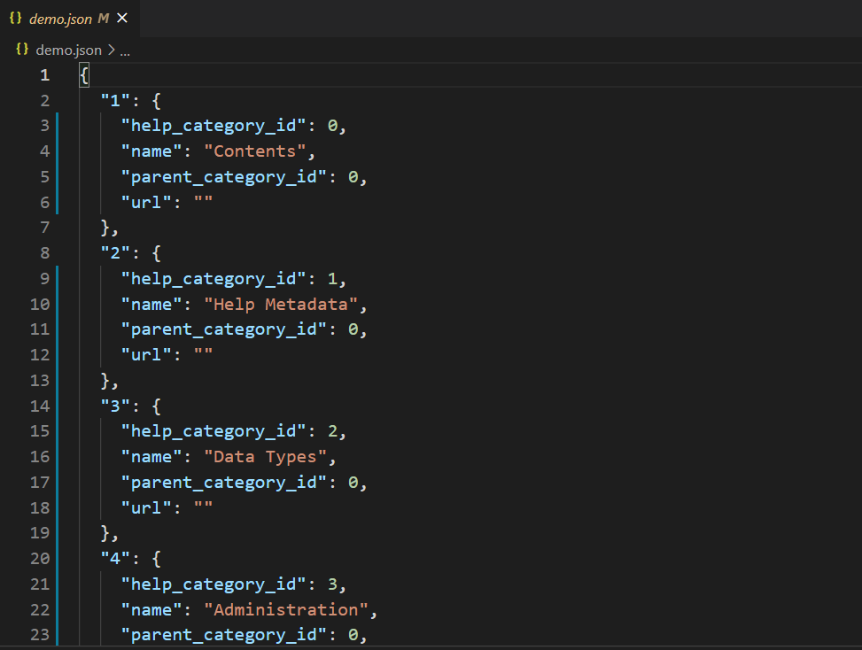

<h1 align="center">Mysql-Json converter</h1>
<div align="center">
  <br>
  <h3>A python code that fetches all the mysql schemas dynamically and converts the mysql data to json</h3>
</div>

---

###  This project was developed as a part of second year Internal assessment
####  Name-Rushabh Gandhi 
####  Branch-Computer engineering -Sem 4 (B.tech)
####  Subject- RDBMS 
####  Faculty Name- Vaibhav Vasani 
####  College- K.J.Somaiya College Of Engineering 
 
---


  
### To run this project :

Clone the project -
```
  $ git clone https://github.com/rushabhgandhi13/Mysql-Json-converter.git
```
  
Install all the reqirements -
```
  $ pip install -r requirements.txt
 ``` 

Run the following commands -

```
python main.py
```

---
#### About the project
The project is a partial implementation to the research paper( [link](https://github.com/rushabhgandhi13/Mysql-Json-converter/blob/main/Ieee_paper.pdf "link") ). the code connects to the mysql server and dynamically fetches all the existing database. it then prompts to select one database on selection of the databse it fetchs all the tables existing in the databse selected and shows a prompt to select a table you want to convert into json and on selection of the table it displays all the json objects which are converted. And the finally the data gets stored in the demo.json file in the same directory. 

---

### Details about the Research Paper
Title: Data Conversion from Traditional Relational Database to MongoDB using XAMPP and NoSQL.
Find the link to the paper ( [link](https://github.com/rushabhgandhi13/Mysql-Json-converter/blob/main/Ieee_paper.pdf "link") ). Also find the explaination to the paper in the power point presention ( [link](https://github.com/rushabhgandhi13/Mysql-Json-converter/blob/main/ieee_1911012.pptx "link") )


-Snapshots of the project :


  
  
  

Finally the file gets stored in demo.json file
 


---
<h3 align="center"><b>Developed with :heart: by <a href="https://github.com/rushabhgandhi13">Rushabh Gandhi</a>.</b></h1>
